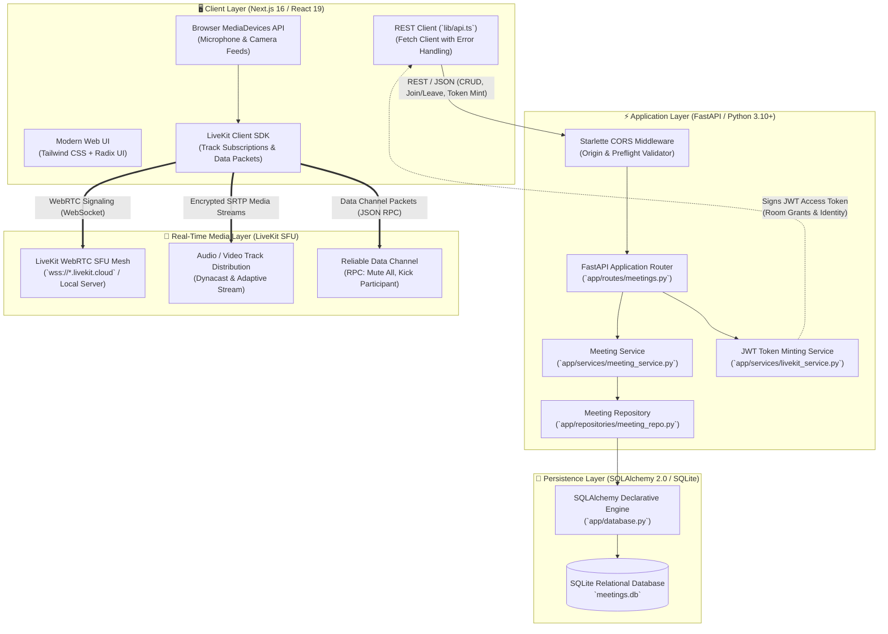
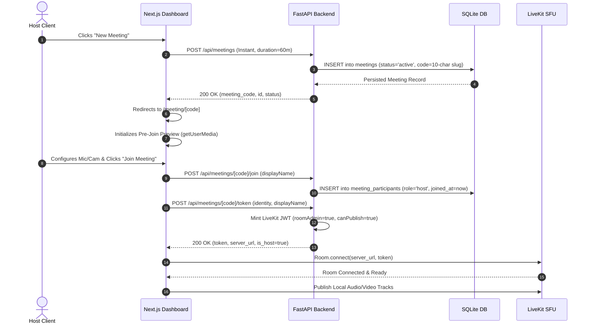
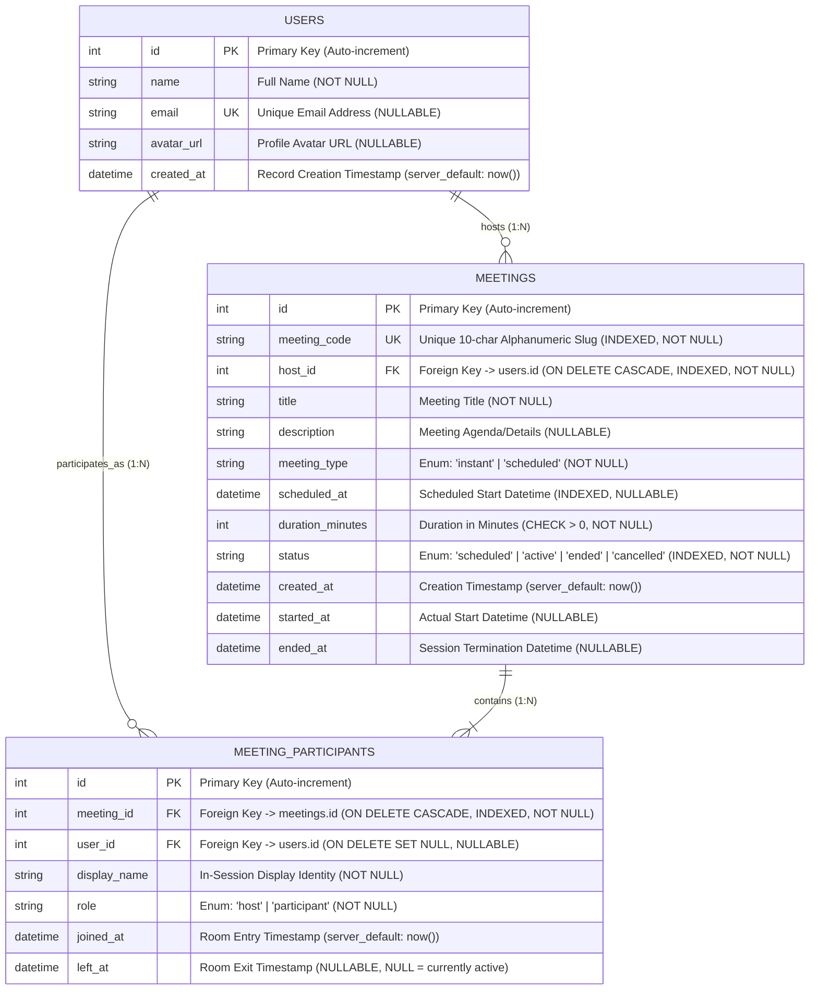
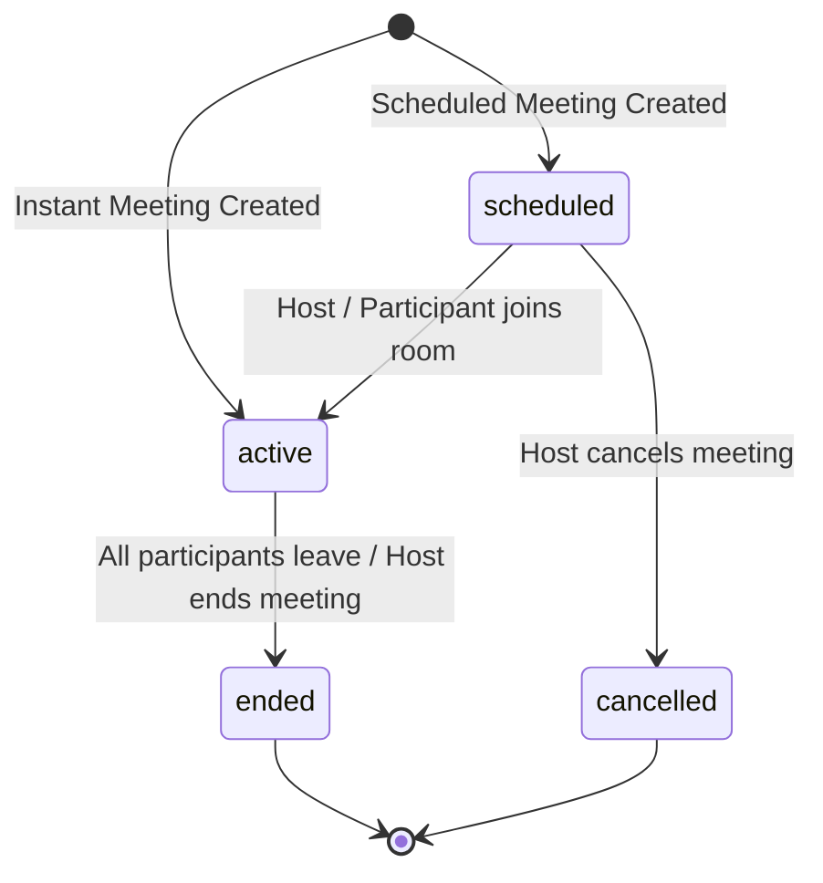

# Zoom Clone — System Architecture & Database Design

A high-performance, full-stack video conferencing platform modeled after Zoom, engineered with **Next.js 16 (App Router)**, **FastAPI (Python 3.10+)**, **SQLAlchemy ORM**, **SQLite**, and **LiveKit WebRTC SFU**.

---

## 🏛 System Architecture Overview

The system operates across four primary architectural layers:
1. **Client & Presentation Layer (Next.js 16 / React 19 / LiveKit Client SDK)**: Renders the dashboard, pre-join media previews, in-call video grid with adaptive streaming, participant controls, and WebRTC data messaging.
2. **Application & Orchestration Layer (FastAPI / Starlette)**: Manages meeting lifecycles, user sessions, participant presence, and cryptographically signs LiveKit JWT tokens with fine-grained room grants.
3. **Data Persistence Layer (SQLAlchemy 2.0 / SQLite)**: Provides relational storage, constraint enforcement, cascading lifecycles, and indexed queries for meetings, users, and participant logs.
4. **Real-Time Media Distribution Layer (LiveKit SFU)**: Handles real-time WebRTC media routing (audio/video tracks) and peer-to-peer data channels for sub-second signaling (e.g., mute-all broadcasts, participant kicks).



---

## 🔄 End-to-End Operational Workflows

### 1. Instant Meeting & Pre-Join Room Initialization


### 2. Multi-Peer Real-Time Collaboration & Remote Control

```mermaid
sequenceDiagram
    autonumber
    actor Host as Host
    actor Guest as Participant
    participant SFU as LiveKit SFU (Selective Forwarding Unit)

    Host->>SFU: Publish AudioTrack & VideoTrack
    Guest->>SFU: Publish AudioTrack & VideoTrack
    SFU-->>Host: Subscribes & forwards Guest's tracks
    SFU-->>Guest: Subscribes & forwards Host's tracks
    
    rect rgb(30, 41, 59)
    note over Host,Guest: Host Remote Moderation (LiveKit Data Channel)
    Host->>SFU: PublishDataPacket: {"type": "MUTE_ALL"} (Reliable)
    SFU-->>Guest: OnDataReceived: {"type": "MUTE_ALL"}
    Guest->>Guest: Disables local mic & updates UI state
    
    Host->>SFU: PublishDataPacket: {"type": "KICK", "target": "guest_id"}
    SFU-->>Guest: OnDataReceived: {"type": "KICK"}
    Guest->>SFU: Room.disconnect()
    Guest->>Guest: Redirect to Dashboard
    end
```


---

## 🗄️ Database Schema & Relational Design

The database is built on **SQLAlchemy 2.0** with **SQLite**, structured to provide strict relational integrity, cascade constraints, indexed lookups, and lifecycle auditing.

### Database UML (Entity-Relationship Diagram)



---

## 🔍 In-Depth Database Specification & Engineering Details

### 1. `users` Table
Stores user accounts and host identities.

| Column | Data Type | Constraints | Description |
|---|---|---|---|
| `id` | `INTEGER` | `PRIMARY KEY`, `INDEX` | Unique identifier for each registered account. |
| `name` | `VARCHAR` | `NOT NULL` | User's full display or account name. |
| `email` | `VARCHAR` | `UNIQUE`, `NULLABLE` | Unique email for authentication and calendar invites. |
| `avatar_url` | `VARCHAR` | `NULLABLE` | Link to profile avatar image. |
| `created_at` | `DATETIME(TZ)` | `server_default=now()` | Account creation timestamp with timezone support. |

#### Design Considerations:
- **Default User Guarantee**: The repository provides an `ensure_default_user()` routine. If the database is freshly initialized without auth middleware, foreign key constraints on `meetings.host_id` are consistently satisfied without constraint violation errors.
- **Relationships**:
  - `meetings`: One-to-Many back-populated by `Meeting.host`.
  - `participations`: One-to-Many back-populated by `MeetingParticipant.user`.

---

### 2. `meetings` Table
Central entity orchestrating conference sessions, schedule timings, and room identifiers.

| Column | Data Type | Constraints | Description |
|---|---|---|---|
| `id` | `INTEGER` | `PRIMARY KEY`, `INDEX` | Internal database surrogate key. |
| `meeting_code` | `VARCHAR` | `UNIQUE`, `INDEX`, `NOT NULL` | Clean 10-character alphanumeric room slug used in invite URLs. |
| `host_id` | `INTEGER` | `FOREIGN KEY(users.id)`, `ON DELETE CASCADE`, `INDEX`, `NOT NULL` | Identifies the owner/host of the meeting. |
| `title` | `VARCHAR` | `NOT NULL` | Subject or topic of the meeting. |
| `description` | `VARCHAR` | `NULLABLE` | Detailed notes or meeting objectives. |
| `meeting_type` | `ENUM(MeetingType)` | `NOT NULL` | `'instant'` for immediate rooms, `'scheduled'` for future calendar items. |
| `scheduled_at` | `DATETIME(TZ)` | `INDEX`, `NULLABLE` | Date and time for planned meetings; `NULL` for ad-hoc instant rooms. |
| `duration_minutes`| `INTEGER` | `CHECK(duration_minutes > 0)`, `NOT NULL` | Scheduled meeting duration in minutes (enforced by DB check constraint). |
| `status` | `ENUM(MeetingStatus)`| `INDEX`, `NOT NULL`, `default='scheduled'` | Lifecycle state: `'scheduled'`, `'active'`, `'ended'`, or `'cancelled'`. |
| `created_at` | `DATETIME(TZ)` | `server_default=now()` | Timestamp when the meeting was booked or initiated. |
| `started_at` | `DATETIME(TZ)` | `NULLABLE` | Timestamp when the first participant entered the room. |
| `ended_at` | `DATETIME(TZ)` | `NULLABLE` | Timestamp when the meeting was formally concluded. |

#### State Machine & Lifecycle Transitions:


#### Query Optimizations & Indexing:
- **`meeting_code` (Unique Index)**: Guaranteed $O(1)$ lookup when users enter a code or open an invite URL (`/meeting/84239176205`).
- **`status` + `scheduled_at` Composite Indexing**: Accelerates dashboard queries separating `/api/meetings/upcoming` (`status IN ('scheduled', 'active') ORDER BY scheduled_at ASC`) from `/api/meetings/recent` (`status = 'ended' ORDER BY ended_at DESC`).
- **Cascade Deletion**: When a user is purged, all associated meetings are automatically cascaded (`ON DELETE CASCADE`), ensuring no orphaned rooms exist.

---

### 3. `meeting_participants` Table
Tracks audit trails, participant attendance, roles, and real-time room occupancy.

| Column | Data Type | Constraints | Description |
|---|---|---|---|
| `id` | `INTEGER` | `PRIMARY KEY`, `INDEX` | Unique participant session ID. |
| `meeting_id` | `INTEGER` | `FOREIGN KEY(meetings.id)`, `ON DELETE CASCADE`, `INDEX`, `NOT NULL` | Associated meeting room record. |
| `user_id` | `INTEGER` | `FOREIGN KEY(users.id)`, `ON DELETE SET NULL`, `NULLABLE` | Registered user ID if logged in; `NULL` for anonymous guests. |
| `display_name` | `VARCHAR` | `NOT NULL` | Screen name provided by the user in the pre-join lobby. |
| `role` | `ENUM(ParticipantRole)`| `NOT NULL`, `default='participant'` | Access role: `'host'` or `'participant'`. |
| `joined_at` | `DATETIME(TZ)` | `server_default=now()` | Exact timestamp the participant entered the room. |
| `left_at` | `DATETIME(TZ)` | `NULLABLE` | Timestamp the participant disconnected (`NULL` means currently connected). |

#### Relational Integrity Design:
- **`ON DELETE CASCADE` on `meeting_id`**: If a meeting record is deleted, all participant history for that room is cleanly cleaned up via SQLAlchemy `cascade="all, delete-orphan"`.
- **`ON DELETE SET NULL` on `user_id`**: If a registered user is removed from the system, historical participation records remain intact for analytics, gracefully nullifying the reference.
- **Active Presence Calculation**: A participant is considered active in the meeting if `left_at IS NULL`. Calling `POST /api/meetings/{code}/leave` timestamps `left_at = datetime.utcnow()`.

---

## 🔌 API Specifications & Data Contracts

All endpoints are prefixed under `/api`.

| Method | Endpoint | Description | Request Body | Response Model |
|---|---|---|---|---|
| `GET` | `/health` | Service health check | None | `{"status": "ok"}` |
| `POST` | `/api/meetings` | Create ad-hoc instant meeting | `{"title": str, "duration_minutes": int}` | `MeetingResponse` |
| `POST` | `/api/meetings/schedule` | Schedule meeting for future | `{"title": str, "scheduled_at": str, "duration_minutes": int}` | `MeetingResponse` |
| `GET` | `/api/meetings/upcoming` | Fetch upcoming & active meetings | None | `List[MeetingResponse]` |
| `GET` | `/api/meetings/recent` | Fetch historical concluded meetings| None | `List[MeetingResponse]` |
| `GET` | `/api/meetings/{code}` | Retrieve meeting metadata & roster | None | `MeetingDetailResponse` |
| `POST` | `/api/meetings/{code}/join`| Register participant entrance | `{"display_name": str}` | `MeetingDetailResponse` |
| `POST` | `/api/meetings/{code}/leave`| Record participant departure | `{"display_name": str}` | `{"status": "success"}` |
| `POST` | `/api/meetings/{code}/token`| Mint cryptographically signed LiveKit JWT | `{"display_name": str, "identity": Optional[str]}` | `TokenResponse` |

### LiveKit Token Generation & Permission Claims
When client requests `/api/meetings/{code}/token`:
- **Identity**: Derived as `{sanitized_name}_{random_hex}`.
- **Host Privileges**: Granted if `display_name` matches the host user or specific meeting creator.
- **Video Grants**:
  - `room`: `meeting_code`
  - `roomJoin`: `true`
  - `canPublish`: `true`
  - `canSubscribe`: `true`
  - `canPublishData`: `true`
  - `roomAdmin`: `true` *(Host only)*
  - `roomRecord`: `true` *(Host only)*

---

## 🛠 Local Development Setup

### 1. Prerequisites
- **Node.js**: v18.0.0+ & `npm`
- **Python**: v3.10+
- **LiveKit Server**: Local binary (included in `livekit-bin/`) or LiveKit Cloud instance.

### 2. Backend Startup
```bash
# Navigate to backend directory
cd backend

# Create & activate Python virtual environment
python -m venv venv
# On Windows:
venv\Scripts\activate
# On Linux/macOS:
source venv/bin/activate

# Install dependencies
pip install -r requirements.txt

# Seed initial idempotent database records
python seed.py

# Start FastAPI development server
uvicorn app.main:app --reload --host 127.0.0.1 --port 8000
```

### 3. Frontend Startup
```bash
# From repository root
npm install

# Start Next.js App Router development server
npm run dev
```

Visit [http://localhost:3000](http://localhost:3000) to access the application.

---

## 📁 Repository Structure

```
├── app/                        # Next.js 16 App Router pages
│   ├── layout.tsx              # Root HTML shell & font providers
│   ├── page.tsx                # Dashboard view (Cards, schedules, history)
│   └── meeting/[id]/page.tsx   # Pre-join preview & WebRTC video room
├── backend/                    # FastAPI Application
│   ├── app/
│   │   ├── database.py         # SQLAlchemy engine, session maker & Base
│   │   ├── main.py             # FastAPI factory, CORS & router mounting
│   │   ├── models/models.py    # Declarative models: User, Meeting, Participant
│   │   ├── repositories/       # Query logic & DB operations
│   │   ├── routes/             # REST route controllers
│   │   ├── schemas/            # Pydantic request/response validation schemas
│   │   └── services/           # Business logic & LiveKit JWT signing
│   ├── requirements.txt        # Python dependencies
│   └── seed.py                 # Idempotent DB initialization script
├── components/                 # UI Component Library
│   ├── dashboard/              # Action cards, schedule modal, meeting lists
│   ├── meeting/                # Video grid, controls, participants panel
│   └── ui/                     # Primitives (Dialog, Tooltip, Avatar, Button)
├── hooks/                      # Custom React Hooks
│   └── use-livekit-room.ts     # LiveKit Room connection & event lifecycle
├── lib/
│   ├── api.ts                  # Typed HTTP client communicating with FastAPI
│   └── utils.ts                # Styling & format helpers
└── meetings.db                 # SQLite database file
```
